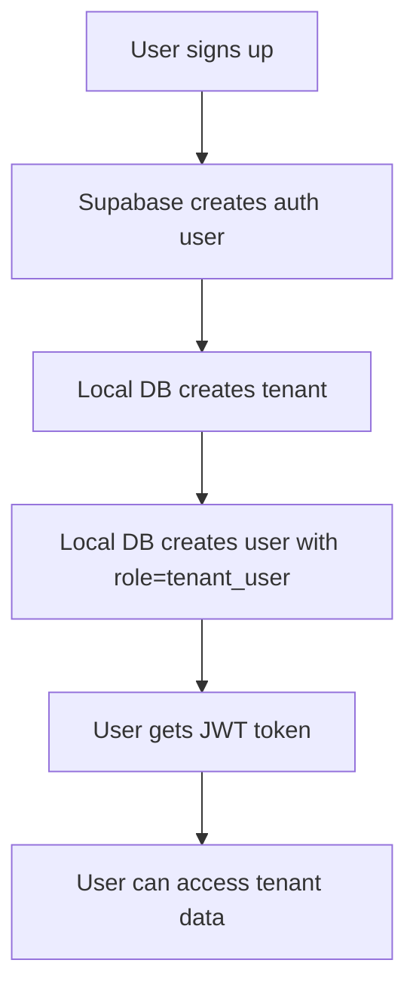
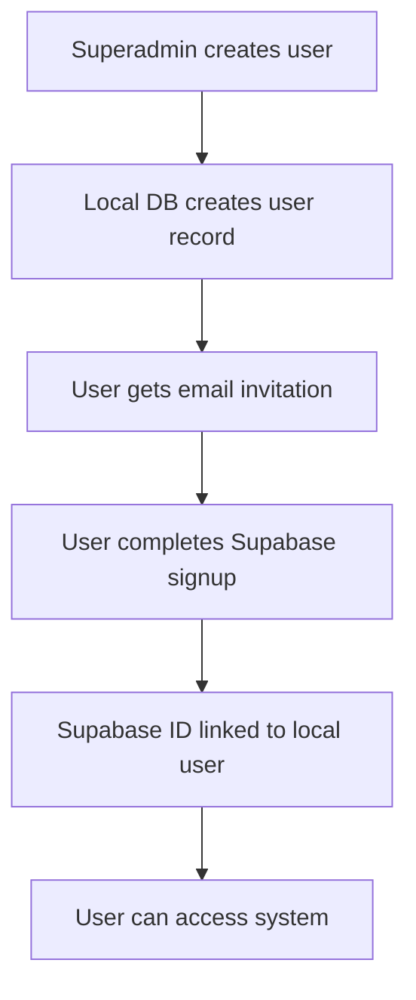

# 👥 Complete User Management & UI Implementation Guide

## 📋 Table of Contents

1. [Overview](#overview)
2. [Architecture](#architecture)
3. [User Types & Roles](#user-types--roles)
4. [Database Schema](#database-schema)
5. [Authentication Flow](#authentication-flow)
6. [API Endpoints](#api-endpoints)
7. [Frontend Implementation](#frontend-implementation)
8. [UI Differentiation](#ui-differentiation)
9. [Role-Based Access Control](#role-based-access-control)
10. [Implementation Steps](#implementation-steps)
11. [Testing Strategy](#testing-strategy)
12. [Deployment Guide](#deployment-guide)

## 🎯 Overview

The PIM system uses a **hybrid approach** for user management:
- **Supabase**: Handles authentication (login/signup, password management, social auth, JWT tokens)
- **Local Database**: Stores business logic (roles, permissions, tenant associations, audit logs)

This approach provides the best of both worlds: robust authentication with flexible business logic and role management.

## 🏗️ Architecture

### User Storage Strategy

```
┌─────────────────┐    ┌──────────────────┐    ┌─────────────────┐
│   Supabase      │    │   Local Database │    │   Application   │
│   (Auth Only)   │    │   (Business      │    │   (Logic &      │
│                  │    │    Logic)        │    │    Permissions) │
├─────────────────┤    ├──────────────────┤    ├─────────────────┤
│ • Email         │    │ • User ID        │    │ • Role-based    │
│ • Password      │    │ • Email          │    │   access        │
│ • Social Auth   │    │ • Supabase ID    │    │ • Tenant        │
│ • JWT Tokens    │    │ • Role           │    │   scoping       │
│ • Password      │    │ • Tenant ID      │    │ • Audit logging │
│   Reset         │    │ • First/Last     │    │ • User          │
│ • Email         │    │   Name           │    │   management    │
│   Verification  │    │ • Is Active      │    │ • Blocking      │
│                 │    │ • Is Blocked     │    │ • Permissions   │
│                 │    │ • Created By     │    │                 │
│                 │    │ • Notes          │    │                 │
└─────────────────┘    └──────────────────┘    └─────────────────┘
```

### User Creation Flow

#### 1. Regular User Signup (Tenant User)


#### 2. Superadmin Creates User


## 👤 User Types & Roles

### 1. **Superadmin**
- **Role**: `superadmin`
- **Tenant ID**: `null` (cross-tenant access)
- **Permissions**: Full system access
- **UI**: Superadmin interface with purple theme
- **Features**: User management, tenant management, audit logs, system settings

### 2. **Analyst**
- **Role**: `analyst`
- **Tenant ID**: `null` (cross-tenant access)
- **Permissions**: Read-only access to all data
- **UI**: Analyst interface with pink theme
- **Features**: Data viewing, analytics, audit logs (read-only)

### 3. **Tenant Admin**
- **Role**: `tenant_admin`
- **Tenant ID**: Required (tenant-scoped)
- **Permissions**: Manage tenant data and users
- **UI**: Tenant admin interface with blue theme
- **Features**: Tenant user management, product management, categories

### 4. **Tenant User**
- **Role**: `tenant_user`
- **Tenant ID**: Required (tenant-scoped)
- **Permissions**: Access tenant data only
- **UI**: Regular user interface with green theme
- **Features**: Product viewing, search, favorites, categories

## 🗄️ Database Schema

### User Model
```python
class User(Base):
    __tablename__ = "users"
    id = Column(Integer, primary_key=True, index=True)
    email = Column(String, unique=True, index=True, nullable=False)
    supabase_user_id = Column(String, index=True, nullable=True)
    password_hash = Column(String, nullable=True, default="")
    tenant_id = Column(Integer, ForeignKey("tenants.id"), nullable=True)
    role = Column(String, nullable=False, default="tenant_user")
    first_name = Column(String, nullable=True)
    last_name = Column(String, nullable=True)
    is_active = Column(Boolean, default=True, nullable=False)
    is_blocked = Column(Boolean, default=False, nullable=False)
    last_login = Column(DateTime, nullable=True)
    created_at = Column(DateTime, default=datetime.utcnow)
    updated_at = Column(DateTime, default=datetime.utcnow, onupdate=datetime.utcnow)
    created_by = Column(Integer, ForeignKey("users.id"), nullable=True)
    notes = Column(Text, nullable=True)

    # Relationships
    tenant = relationship("Tenant", back_populates="users")
    created_users = relationship("User", backref=relationship("creator", remote_side=[id]))
    audit_logs = relationship("AuditLog", back_populates="user")
```

### Audit Log Model
```python
class AuditLog(Base):
    __tablename__ = "audit_logs"
    id = Column(Integer, primary_key=True, index=True)
    user_id = Column(Integer, ForeignKey("users.id"), nullable=False)
    action = Column(String, nullable=False)
    resource_type = Column(String, nullable=False)
    resource_id = Column(Integer, nullable=True)
    resource_name = Column(String, nullable=True)
    details = Column(Text, nullable=True)
    ip_address = Column(String, nullable=True)
    user_agent = Column(String, nullable=True)
    audit_metadata = Column(JSON, nullable=True)
    created_at = Column(DateTime, default=datetime.utcnow)

    user = relationship("User", back_populates="audit_logs")
```

## 🔐 Authentication Flow

### 1. User Login Process
```javascript
const login = async (email, password) => {
  // 1. Authenticate with Supabase
  const { data, error } = await supabase.auth.signInWithPassword({
    email,
    password
  });

  if (error) throw error;

  // 2. Get user details from local database
  const response = await fetch('/api/v1/auth/me', {
    headers: {
      'Authorization': `Bearer ${data.session.access_token}`
    }
  });

  const user = await response.json();
  
  // 3. Store user info and redirect based on role
  setUser(user);
  
  if (user.is_superadmin) {
    navigate('/superadmin/dashboard');
  } else if (user.is_analyst) {
    navigate('/analyst/dashboard');
  } else if (user.is_tenant_admin) {
    navigate('/admin/dashboard');
  } else {
    navigate('/dashboard');
  }
};
```

### 2. Role-Based Route Protection
```javascript
const ProtectedRoute = ({ user, requiredRole, children }) => {
  const hasAccess = () => {
    if (!user) return false;
    
    switch (requiredRole) {
      case 'superadmin':
        return user.is_superadmin;
      case 'analyst':
        return user.is_superadmin || user.is_analyst;
      case 'tenant_admin':
        return user.is_superadmin || user.is_tenant_admin;
      case 'tenant_user':
        return true;
      default:
        return false;
    }
  };

  if (!hasAccess()) {
    return <Navigate to="/unauthorized" />;
  }

  return children;
};
```

## 🔌 API Endpoints

### Superadmin Endpoints
```bash
# User Management
GET    /api/v1/superadmin/users              # List all users
GET    /api/v1/superadmin/users/{id}         # Get user details
POST   /api/v1/superadmin/users              # Create user
PUT    /api/v1/superadmin/users/{id}         # Update user
DELETE /api/v1/superadmin/users/{id}         # Delete user
POST   /api/v1/superadmin/users/{id}/block   # Block user
POST   /api/v1/superadmin/users/{id}/unblock # Unblock user
POST   /api/v1/superadmin/users/{id}/reset-password # Reset password

# Tenant Management
GET    /api/v1/superadmin/tenants            # List all tenants
GET    /api/v1/superadmin/tenants/{id}       # Get tenant details
PUT    /api/v1/superadmin/tenants/{id}       # Update tenant

# Product Management
GET    /api/v1/superadmin/products           # List all products

# Audit Logs
GET    /api/v1/superadmin/audit-logs         # Get audit logs

# Dashboard
GET    /api/v1/superadmin/dashboard          # Get dashboard stats
```

### Authentication Endpoints
```bash
POST   /api/v1/auth/signup                   # User signup
POST   /api/v1/auth/login                    # User login
GET    /api/v1/auth/me                       # Get current user
POST   /api/v1/auth/logout                   # User logout
```

## 🎨 Frontend Implementation

### 1. Role-Based Navigation
```typescript
// components/Navigation.tsx
const Navigation: React.FC = () => {
  const { user, logout } = useAuth();
  const navigate = useNavigate();

  const getNavigationItems = (): NavigationItem[] => {
    if (!user) return [];

    if (user.is_superadmin) {
      return [
        { label: "Dashboard", path: "/superadmin/dashboard", icon: "dashboard" },
        { label: "Users", path: "/superadmin/users", icon: "users" },
        { label: "Tenants", path: "/superadmin/tenants", icon: "tenants" },
        { label: "Products", path: "/superadmin/products", icon: "products" },
        { label: "Audit Logs", path: "/superadmin/audit-logs", icon: "audit" },
        { label: "Settings", path: "/superadmin/settings", icon: "settings" }
      ];
    }

    if (user.is_analyst) {
      return [
        { label: "Dashboard", path: "/analyst/dashboard", icon: "dashboard" },
        { label: "Users", path: "/analyst/users", icon: "users" },
        { label: "Tenants", path: "/analyst/tenants", icon: "tenants" },
        { label: "Products", path: "/analyst/products", icon: "products" },
        { label: "Audit Logs", path: "/analyst/audit-logs", icon: "audit" },
        { label: "Analytics", path: "/analyst/analytics", icon: "analytics" }
      ];
    }

    if (user.is_tenant_admin) {
      return [
        { label: "Dashboard", path: "/admin/dashboard", icon: "dashboard" },
        { label: "Users", path: "/admin/users", icon: "users" },
        { label: "Products", path: "/admin/products", icon: "products" },
        { label: "Categories", path: "/admin/categories", icon: "categories" },
        { label: "Settings", path: "/admin/settings", icon: "settings" }
      ];
    }

    // Regular tenant user
    return [
      { label: "Dashboard", path: "/dashboard", icon: "dashboard" },
      { label: "Products", path: "/products", icon: "products" },
      { label: "Search", path: "/search", icon: "search" },
      { label: "Categories", path: "/categories", icon: "categories" },
      { label: "Favorites", path: "/favorites", icon: "heart" }
    ];
  };

  return (
    <nav className="bg-white shadow-lg">
      <div className="max-w-7xl mx-auto px-4">
        <div className="flex justify-between h-16">
          <div className="flex">
            <div className="flex-shrink-0 flex items-center">
              
            </div>
            <div className="hidden sm:ml-6 sm:flex sm:space-x-8">
              {getNavigationItems().map((item) => (
                <NavLink
                  key={item.path}
                  to={item.path}
                  className={({ isActive }) =>
                    `inline-flex items-center px-1 pt-1 border-b-2 text-sm font-medium ${
                      isActive
                        ? 'border-indigo-500 text-gray-900'
                        : 'border-transparent text-gray-500 hover:border-gray-300 hover:text-gray-700'
                    }`
                  }
                >
                  {item.icon && <i className={`fas fa-${item.icon} mr-2`} />}
                  {item.label}
                </NavLink>
              ))}
            </div>
          </div>
          <div className="flex items-center">
            <div className="flex-shrink-0">
              <span className="text-sm text-gray-500 mr-4">
                {user?.first_name} {user?.last_name}
              </span>
              <button
                onClick={handleLogout}
                className="bg-red-600 hover:bg-red-700 text-white px-4 py-2 rounded-md text-sm font-medium"
              >
                Logout
              </button>
            </div>
          </div>
        </div>
      </div>
    </nav>
  );
};
```

### 2. Permission Gates
```typescript
// components/PermissionGate.tsx
const PermissionGate = ({ user, requiredRole, children }) => {
  const hasPermission = () => {
    switch (requiredRole) {
      case 'superadmin':
        return user.is_superadmin;
      case 'analyst':
        return user.is_superadmin || user.is_analyst;
      case 'tenant_admin':
        return user.is_superadmin || user.is_tenant_admin;
      case 'tenant_user':
        return true;
      default:
        return false;
    }
  };

  return hasPermission() ? children : null;
};

// Usage
<PermissionGate user={user} requiredRole="superadmin">
  <UserManagementPanel />
</PermissionGate>

<PermissionGate user={user} requiredRole="analyst">
  <DataAnalyticsPanel />
</PermissionGate>
```

## 🎨 UI Differentiation

### 1. Role-Based Dashboards

#### Superadmin Dashboard
```typescript
// pages/SuperadminDashboard.tsx
const SuperadminDashboard: React.FC = () => {
  const { user } = useAuth();
  const [stats, setStats] = useState<DashboardStats | null>(null);

  return (
    <div className="min-h-screen bg-gradient-to-br from-purple-900 via-blue-900 to-indigo-900">
      <div className="max-w-7xl mx-auto px-4 sm:px-6 lg:px-8 py-8">
        <div className="mb-8">
          <h1 className="text-3xl font-bold text-white">
            Superadmin Dashboard
          </h1>
          <p className="text-purple-200 mt-2">
            Welcome back, {user?.first_name}! Here's what's happening across all tenants.
          </p>
        </div>

        {/* Statistics Grid */}
        <div className="grid grid-cols-1 md:grid-cols-2 lg:grid-cols-4 gap-6 mb-8">
          <StatCard title="Total Users" value={stats?.total_users || 0} icon="users" color="blue" />
          <StatCard title="Total Tenants" value={stats?.total_tenants || 0} icon="building" color="green" />
          <StatCard title="Total Products" value={stats?.total_products || 0} icon="box" color="purple" />
          <StatCard title="Blocked Users" value={stats?.blocked_users || 0} icon="ban" color="red" />
        </div>

        {/* Quick Actions */}
        <div className="grid grid-cols-1 lg:grid-cols-2 gap-6 mb-8">
          <div className="bg-white rounded-lg shadow-lg p-6">
            <h2 className="text-xl font-semibold text-gray-900 mb-4">Quick Actions</h2>
            <div className="grid grid-cols-2 gap-4">
              <button className="bg-blue-600 hover:bg-blue-700 text-white px-4 py-2 rounded-md">Create User</button>
              <button className="bg-green-600 hover:bg-green-700 text-white px-4 py-2 rounded-md">Add Tenant</button>
              <button className="bg-purple-600 hover:bg-purple-700 text-white px-4 py-2 rounded-md">View Audit Logs</button>
              <button className="bg-orange-600 hover:bg-orange-700 text-white px-4 py-2 rounded-md">System Settings</button>
            </div>
          </div>
          <div className="bg-white rounded-lg shadow-lg p-6">
            <h2 className="text-xl font-semibold text-gray-900 mb-4">Recent Activity</h2>
            <RecentActivity />
          </div>
        </div>

        {/* User Management */}
        <div className="bg-white rounded-lg shadow-lg p-6">
          <h2 className="text-xl font-semibold text-gray-900 mb-4">User Management</h2>
          <UserManagement />
        </div>
      </div>
    </div>
  );
};
```

#### Analyst Dashboard
```typescript
// pages/AnalystDashboard.tsx
const AnalystDashboard: React.FC = () => {
  const { user } = useAuth();
  const [stats, setStats] = useState<any>(null);

  return (
    <div className="min-h-screen bg-gradient-to-br from-pink-900 via-red-900 to-purple-900">
      <div className="max-w-7xl mx-auto px-4 sm:px-6 lg:px-8 py-8">
        <div className="mb-8">
          <h1 className="text-3xl font-bold text-white">Analyst Dashboard</h1>
          <p className="text-pink-200 mt-2">
            Welcome back, {user?.first_name}! Here's your data overview.
          </p>
        </div>

        {/* Statistics Grid */}
        <div className="grid grid-cols-1 md:grid-cols-3 gap-6 mb-8">
          <StatCard title="Total Users" value={stats?.total_users || 0} icon="users" color="pink" />
          <StatCard title="Total Tenants" value={stats?.total_tenants || 0} icon="building" color="red" />
          <StatCard title="Total Products" value={stats?.total_products || 0} icon="box" color="purple" />
        </div>

        {/* Data Analytics */}
        <div className="bg-white rounded-lg shadow-lg p-6">
          <h2 className="text-xl font-semibold text-gray-900 mb-4">Data Analytics</h2>
          <DataAnalytics />
        </div>
      </div>
    </div>
  );
};
```

#### Tenant Admin Dashboard
```typescript
// pages/TenantAdminDashboard.tsx
const TenantAdminDashboard: React.FC = () => {
  const { user } = useAuth();
  const [stats, setStats] = useState<any>(null);

  return (
    <div className="min-h-screen bg-gradient-to-br from-blue-900 via-cyan-900 to-teal-900">
      <div className="max-w-7xl mx-auto px-4 sm:px-6 lg:px-8 py-8">
        <div className="mb-8">
          <h1 className="text-3xl font-bold text-white">Tenant Admin Dashboard</h1>
          <p className="text-blue-200 mt-2">
            Welcome back, {user?.first_name}! Manage your tenant's data and users.
          </p>
        </div>

        {/* Statistics Grid */}
        <div className="grid grid-cols-1 md:grid-cols-3 gap-6 mb-8">
          <StatCard title="Users" value={stats?.users_count || 0} icon="users" color="blue" />
          <StatCard title="Products" value={stats?.products_count || 0} icon="box" color="cyan" />
          <StatCard title="Categories" value={stats?.categories_count || 0} icon="folder" color="teal" />
        </div>

        {/* Tenant Management */}
        <div className="grid grid-cols-1 lg:grid-cols-2 gap-6">
          <div className="bg-white rounded-lg shadow-lg p-6">
            <h2 className="text-xl font-semibold text-gray-900 mb-4">Tenant Users</h2>
            <TenantUsers />
          </div>
          <div className="bg-white rounded-lg shadow-lg p-6">
            <h2 className="text-xl font-semibold text-gray-900 mb-4">Tenant Products</h2>
            <TenantProducts />
          </div>
        </div>
      </div>
    </div>
  );
};
```

#### Regular User Dashboard
```typescript
// pages/UserDashboard.tsx
const UserDashboard: React.FC = () => {
  const { user } = useAuth();
  const [recentProducts, setRecentProducts] = useState([]);

  return (
    <div className="min-h-screen bg-gradient-to-br from-green-400 via-blue-500 to-purple-600">
      <div className="max-w-7xl mx-auto px-4 sm:px-6 lg:px-8 py-8">
        <div className="mb-8">
          <h1 className="text-3xl font-bold text-white">
            Welcome back, {user?.first_name || user?.email}!
          </h1>
          <p className="text-blue-100 mt-2">
            Here's what's new in your product catalog.
          </p>
        </div>

        {/* Quick Actions */}
        <div className="grid grid-cols-1 md:grid-cols-3 gap-6 mb-8">
          <QuickActionCard title="Search Products" icon="search" path="/search" color="blue" />
          <QuickActionCard title="My Favorites" icon="heart" path="/favorites" color="red" />
          <QuickActionCard title="Recent Products" icon="clock" path="/products" color="green" />
        </div>

        {/* Recent Products */}
        <div className="bg-white rounded-lg shadow-lg p-6">
          <h2 className="text-xl font-semibold text-gray-900 mb-4">Recent Products</h2>
          <RecentProducts products={recentProducts} />
        </div>
      </div>
    </div>
  );
};
```

### 2. Role-Based Styling
```css
/* styles/dashboards.css */

/* Superadmin Dashboard */
.superadmin-dashboard {
  background: linear-gradient(135deg, #667eea 0%, #764ba2 100%);
  min-height: 100vh;
}

.superadmin-dashboard .stats-grid {
  display: grid;
  grid-template-columns: repeat(auto-fit, minmax(250px, 1fr));
  gap: 1.5rem;
}

/* Analyst Dashboard */
.analyst-dashboard {
  background: linear-gradient(135deg, #f093fb 0%, #f5576c 100%);
  min-height: 100vh;
}

.analyst-dashboard .stats-grid {
  display: grid;
  grid-template-columns: repeat(auto-fit, minmax(300px, 1fr));
  gap: 1.5rem;
}

/* Tenant Admin Dashboard */
.tenant-admin-dashboard {
  background: linear-gradient(135deg, #4facfe 0%, #00f2fe 100%);
  min-height: 100vh;
}

.tenant-admin-dashboard .stats-grid {
  display: grid;
  grid-template-columns: repeat(auto-fit, minmax(300px, 1fr));
  gap: 1.5rem;
}

/* Regular User Dashboard */
.user-dashboard {
  background: linear-gradient(135deg, #a8edea 0%, #fed6e3 100%);
  min-height: 100vh;
}

.user-dashboard .stats-grid {
  display: grid;
  grid-template-columns: repeat(auto-fit, minmax(200px, 1fr));
  gap: 1rem;
}

/* Common Dashboard Styles */
.dashboard-card {
  background: white;
  border-radius: 0.5rem;
  box-shadow: 0 10px 15px -3px rgba(0, 0, 0, 0.1);
  padding: 1.5rem;
}

.dashboard-card h2 {
  font-size: 1.25rem;
  font-weight: 600;
  color: #1f2937;
  margin-bottom: 1rem;
}

.stat-card {
  background: white;
  border-radius: 0.5rem;
  box-shadow: 0 4px 6px -1px rgba(0, 0, 0, 0.1);
  padding: 1.5rem;
  text-align: center;
}

.stat-card .stat-value {
  font-size: 2rem;
  font-weight: bold;
  color: #1f2937;
}

.stat-card .stat-label {
  font-size: 0.875rem;
  color: #6b7280;
  margin-top: 0.5rem;
}
```

## 🔐 Role-Based Access Control

### Permission System
```typescript
interface UserWithPermissions extends User {
  is_superadmin: boolean;
  is_analyst: boolean;
  is_tenant_admin: boolean;
  is_tenant_user: boolean;
  can_view_all_tenants: boolean;
  can_edit_all_tenants: boolean;
  can_manage_users: boolean;
}

// Permission checks
const hasPermission = (user: User, requiredPermission: string): boolean => {
  switch (requiredPermission) {
    case 'view_all_tenants':
      return user.is_superadmin || user.is_analyst;
    case 'edit_all_tenants':
      return user.is_superadmin;
    case 'manage_users':
      return user.is_superadmin || user.is_tenant_admin;
    case 'view_audit_logs':
      return user.is_superadmin || user.is_analyst;
    case 'edit_products':
      return user.is_superadmin || user.is_tenant_admin || user.is_tenant_user;
    default:
      return false;
  }
};
```

### Route Protection
```typescript
// components/ProtectedRoute.tsx
const ProtectedRoute: React.FC<ProtectedRouteProps> = ({
  children,
  requiredRole,
  fallbackPath = '/unauthorized'
}) => {
  const { user, loading } = useAuth();
  const location = useLocation();

  if (loading) {
    return <div className="flex justify-center items-center h-64">Loading...</div>;
  }

  if (!user) {
    return <Navigate to="/login" state={{ from: location }} replace />;
  }

  if (user.is_blocked) {
    return <Navigate to="/blocked" replace />;
  }

  if (requiredRole) {
    const hasAccess = () => {
      switch (requiredRole) {
        case 'superadmin':
          return user.is_superadmin;
        case 'analyst':
          return user.is_superadmin || user.is_analyst;
        case 'tenant_admin':
          return user.is_superadmin || user.is_tenant_admin;
        case 'tenant_user':
          return true;
        default:
          return false;
      }
    };

    if (!hasAccess()) {
      return <Navigate to={fallbackPath} replace />;
    }
  }

  return <>{children}</>;
};
```

## 🚀 Implementation Steps

### Phase 1: Backend Setup
1. **Database Migration**: Run migrations to create new tables
2. **API Endpoints**: Implement superadmin endpoints
3. **Authentication**: Update auth service for role-based access
4. **Testing**: Test all API endpoints

### Phase 2: Frontend Setup
1. **Routing**: Implement role-based routing
2. **Components**: Create role-specific components
3. **Styling**: Apply role-based styling
4. **Testing**: Test all user flows

### Phase 3: Integration
1. **API Integration**: Connect frontend to backend
2. **User Management**: Implement user CRUD operations
3. **Audit Logging**: Implement audit trail
4. **Testing**: End-to-end testing

### Phase 4: Deployment
1. **Environment Setup**: Configure production environment
2. **Database Setup**: Set up production database
3. **Deployment**: Deploy application
4. **Monitoring**: Set up monitoring and logging

## 🧪 Testing Strategy

### Unit Tests
```typescript
// tests/user-management.test.ts
describe('User Management', () => {
  test('superadmin can create users', async () => {
    const superadmin = await createTestUser({ role: 'superadmin' });
    const newUser = await createUser(superadmin, {
      email: 'test@example.com',
      role: 'tenant_user'
    });
    expect(newUser.role).toBe('tenant_user');
  });

  test('analyst cannot create users', async () => {
    const analyst = await createTestUser({ role: 'analyst' });
    await expect(createUser(analyst, {
      email: 'test@example.com',
      role: 'tenant_user'
    })).rejects.toThrow('Forbidden');
  });
});
```

### Integration Tests
```typescript
// tests/integration/auth.test.ts
describe('Authentication Flow', () => {
  test('user login redirects to correct dashboard', async () => {
    const user = await createTestUser({ role: 'superadmin' });
    const response = await login(user.email, 'password');
    expect(response.redirectUrl).toBe('/superadmin/dashboard');
  });
});
```

### E2E Tests
```typescript
// tests/e2e/user-management.spec.ts
describe('User Management E2E', () => {
  it('superadmin can manage users', () => {
    cy.login('superadmin@example.com', 'password');
    cy.visit('/superadmin/users');
    cy.get('[data-testid="create-user-btn"]').click();
    cy.get('[data-testid="user-email"]').type('newuser@example.com');
    cy.get('[data-testid="user-role"]').select('tenant_user');
    cy.get('[data-testid="save-user-btn"]').click();
    cy.get('[data-testid="user-list"]').should('contain', 'newuser@example.com');
  });
});
```

## 🚀 Deployment Guide

### 1. Environment Setup
```bash
# Create .env file
cp .env.example .env

# Set environment variables
SUPABASE_URL=your_supabase_url
SUPABASE_ANON_KEY=your_supabase_anon_key
SUPABASE_SERVICE_ROLE_KEY=your_supabase_service_role_key
SECRET_KEY=your_secret_key
DATABASE_URL=sqlite:///./db/pim.db
```

### 2. Database Setup
```bash
# Run migrations
python -m app.core.migrations

# Create superadmin user
python -c "
from app.core.dependencies import get_db
from app.models.user import User
from app.core.security import get_password_hash

db = next(get_db())
superadmin = User(
    email='admin@example.com',
    password_hash=get_password_hash('admin123'),
    role='superadmin',
    first_name='Admin',
    last_name='User',
    is_active=True
)
db.add(superadmin)
db.commit()
"
```

### 3. Docker Deployment
```bash
# Build and run with Docker Compose
docker-compose up --build -d

# Check status
docker-compose ps

# View logs
docker-compose logs -f pim
```

### 4. Health Check
```bash
# Test health endpoint
curl http://localhost:8004/health

# Test superadmin dashboard
curl -H "Authorization: Bearer $TOKEN" http://localhost:8004/api/v1/superadmin/dashboard
```

## 📊 Monitoring & Maintenance

### 1. Audit Logging
- All user actions are logged
- Logs include user ID, action, resource, timestamp
- Logs are searchable and filterable

### 2. User Management
- Superadmins can manage all users
- Tenant admins can manage tenant users
- Users can be blocked/unblocked
- Password reset functionality

### 3. System Health
- Health check endpoint
- Database connection monitoring
- API response time monitoring
- Error logging and alerting

## 🎯 Key Benefits

1. **Centralized Authentication**: Supabase handles all auth complexity
2. **Flexible Permissions**: Local database stores business logic
3. **Role-Based UI**: Different interfaces for different user types
4. **Audit Trail**: Complete tracking of user actions
5. **Scalable**: Easy to add new roles and permissions
6. **Secure**: Separation of concerns between auth and business logic
7. **User-Friendly**: Clear visual distinction between user types
8. **Maintainable**: Well-structured code with clear separation of concerns

This comprehensive implementation provides a robust, scalable, and user-friendly user management system that can grow with your application's needs! 